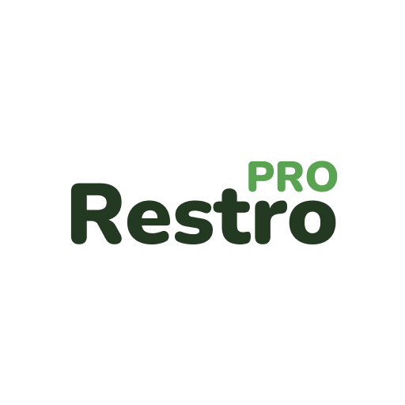
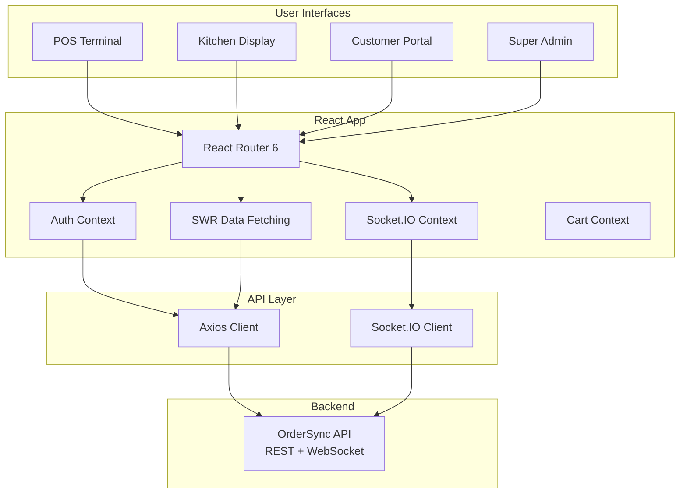
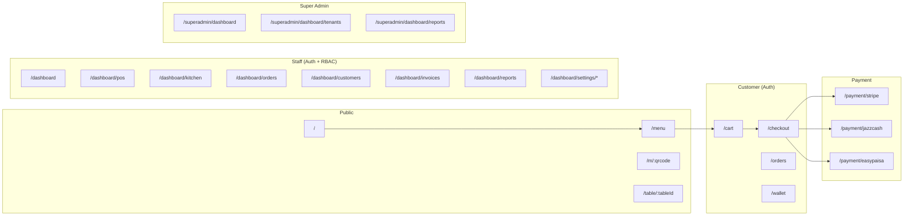

<div align="center">
  
  <h1>🍽️ OrderSync Frontend</h1>
  <p><strong>Multi-tenant Restaurant POS, Kitchen Display, QR Menu & Customer Portal — a modern React PWA.</strong></p>

  <p>
    
    
    
    
    
    <a href="https://github.com/SohaibKhaliq/OrderSync-Frontend/stargazers">
      
    </a>
    <a href="https://github.com/SohaibKhaliq/OrderSync-Frontend/commits/master">
      
    </a>
  </p>

  <h3>
    <a href="#-overview">Overview</a> •
    <a href="#-features">Features</a> •
    <a href="#-quick-start">Quick Start</a> •
    <a href="#-architecture">Architecture</a> •
    <a href="#-project-structure">Structure</a>
  </h3>
</div>

---

## 📋 Table of Contents

- [Overview](#-overview)
- [Features](#-features)
- [Architecture](#-architecture)
- [Tech Stack](#-tech-stack)
- [Quick Start](#-quick-start)
- [Available Scripts](#-available-scripts)
- [Project Structure](#-project-structure)
- [Environment Variables](#-environment-variables)
- [Portals](#-portals)
- [Contributing](#-contributing)
- [License](#-license)

---

## 📖 Overview

**OrderSync Frontend** is the complete React single-page application for a multi-tenant restaurant management platform. It provides four integrated portals — **Staff POS**, **Kitchen Display**, **Customer Cafe Portal**, and **Super Admin Dashboard** — all within a single PWA powered by Vite and Tailwind CSS.

Built as the frontend counterpart to the [OrderSync API](https://github.com/SohaibKhaliq/OrderSync), it communicates via REST and real-time WebSocket (Socket.IO) for instant order updates.

### The Problem

Restaurant operations need multiple interfaces — a POS terminal for waitstaff, a kitchen display for cooks, a customer-facing menu, and an admin dashboard — all staying in sync in real time.

### The Solution

OrderSync Frontend unifies all these interfaces into a single, responsive SPA with:

- **Touch-friendly POS** for fast order entry
- **Real-time Kitchen Display** with audio alerts
- **QR-based contactless menu** for customers
- **Customer portal** with order tracking and wallet
- **Super admin panel** for multi-tenant management
- **PWA support** for install-on-device capability

---

## ✨ Features

| Feature | Description | Portal |
|---------|-------------|--------|
| 💳 **Point of Sale** | Touch-optimized POS with cart, variants, addons, discounts, and token system | Staff |
| 🖥️ **Kitchen Display** | Real-time order streaming with item-level status (created → preparing → completed) and text-to-speech | Staff |
| 📱 **QR Menu** | Dynamic, public-facing menu accessible by QR code — browse, cart, order without account | Customer |
| 🛒 **Customer Portal** | Authenticated portal with menu browsing, cart, checkout, order tracking, and digital wallet | Customer |
| 📅 **Reservations** | Online table booking with date/time selection and party size | Both |
| 💳 **Multi-gateway Payments** | Stripe, JazzCash, and EasyPaisa integration with wallet balance | Customer |
| 🧾 **Invoice Management** | Auto-generated invoices with itemized billing and payment status | Staff |
| 📊 **Dashboard** | Sales analytics, daily summaries, popular items, and revenue breakdown | Staff |
| 👑 **Super Admin** | Central management of all tenants, subscription history, and platform-wide reports | Admin |
| 🔐 **RBAC** | Scope-protected routes — 20+ granular permissions (POS, KITCHEN, ORDERS, SETTINGS, etc.) | Staff |
| 🔄 **Real-time Sync** | Socket.IO live updates — orders appear instantly on kitchen display | All |
| 🔊 **Audio Announcements** | Text-to-speech for new orders in kitchen | Staff |
| 📦 **PWA** | Offline-capable, installable on mobile and desktop | All |
| 🎨 **Responsive UI** | Tailwind CSS + DaisyUI with dark/light support | All |

---

## 🏗 Architecture



### Route Map



---

## 🛠 Tech Stack

| Category | Technology | Version |
|----------|-----------|---------|
| **Framework** | React | 18.2 |
| **Build Tool** | Vite | 5.x |
| **Routing** | React Router DOM | 6.x |
| **Styling** | Tailwind CSS + DaisyUI | 3.x / 4.x |
| **UI Components** | Headless UI, React Select | 1.x / 5.x |
| **Data Fetching** | SWR + Axios | 2.x / 1.x |
| **Real-time** | Socket.IO Client | 4.x |
| **Payments** | Stripe JS, react-stripe-js | 9.x / 6.x |
| **Icons** | Tabler Icons React | 2.x |
| **Notifications** | React Hot Toast | 2.x |
| **QR Code** | qrcode | 1.x |
| **CSV Export** | json2csv | 7.x |
| **File Save** | file-saver | 2.x |
| **Cookies** | js-cookie | 3.x |
| **PWA** | vite-plugin-pwa | 0.19 |
| **Image Compression** | browser-image-compression | 2.x |
| **Classnames** | clsx | 2.x |

---

## 🚀 Quick Start

### Prerequisites

- Node.js 18.x or higher
- npm or yarn
- [OrderSync Backend API](https://github.com/SohaibKhaliq/OrderSync) running

### Setup

```bash
# Clone
git clone https://github.com/SohaibKhaliq/OrderSync-Frontend.git
cd OrderSync-Frontend

# Install dependencies
npm install

# Configure environment
cp .env.example .env
# Edit .env with your backend URL and Stripe keys

# Start development server
npm run dev
```

The app will be available at **http://localhost:5173**.

---

## 📜 Available Scripts

| Script | Description |
|--------|-------------|
| `npm run dev` | Start development server with hot-reload (exposed to network via `--host`) |
| `npm run build` | Build for production to `dist/` folder |
| `npm run preview` | Preview production build locally |
| `npm run test` | Run test suite |

---

## 🔧 Environment Variables

| Variable | Required | Description | Default |
|----------|----------|-------------|---------|
| `VITE_BACKEND` | ✅ | Backend REST API base URL | `http://localhost:3000/api/v1` |
| `VITE_BACKEND_SOCKET_IO` | ✅ | Socket.IO server URL | `http://localhost:3000` |
| `VITE_BACKEND_IMAGES_BASE_URL` | ✅ | Base URL for uploaded images | `http://localhost:3000` |
| `VITE_FRONTEND_DOMAIN` | ✅ | Frontend domain for CORS | `http://localhost:5173` |
| `VITE_STRIPE_PUBLIC_KEY` | ✅ | Stripe publishable key | — |
| `VITE_STRIPE_PRODUCT_SUBSCRIPTION_KEY` | ⚠️ | Stripe subscription price ID | — |

---

## 📂 Project Structure

```
OrderSync-Frontend/
├── public/                          # Static assets
│   ├── favicon.png
│   ├── logo.png / logo_192.png     # App icons (PWA)
│   ├── new_order_sound.mp3         # KDS new-order audio alert
│   └── assets/                     # SVG illustrations, hero images
├── src/
│   ├── main.jsx                    # App entry point
│   ├── App.jsx                     # Root component with routing (40+ routes)
│   ├── index.css                   # Tailwind imports + global styles
│   ├── components/                 # Reusable UI components
│   │   ├── AppBar.jsx              # Top navigation bar
│   │   ├── Navbar.jsx              # Side navigation (collapsible)
│   │   ├── Page.jsx                # Page layout wrapper
│   │   ├── CustomerCard.jsx        # Customer profile card
│   │   ├── ReservationCard.jsx     # Reservation display card
│   │   ├── DialogAddCustomer.jsx   # Customer creation dialog
│   │   └── ...
│   ├── config/                     # App configuration
│   │   ├── config.jsx              # API endpoints, constants
│   │   ├── scopes.jsx              # RBAC scope definitions
│   │   └── currencies.config.jsx   # Currency formatting
│   ├── contexts/                   # React Context providers
│   │   ├── SocketContext.jsx       # WebSocket connection state
│   │   ├── CafeCartContext.jsx     # Customer cart state
│   │   ├── CustomerContext.jsx     # Customer auth state
│   │   └── NavbarContext.jsx       # Sidebar collapse state
│   ├── controllers/                # Data fetching (SWR hooks)
│   │   ├── pos.controller.js
│   │   ├── orders.controller.js
│   │   ├── kitchen.controller.js
│   │   ├── menu_item.controller.js
│   │   ├── dashboard.controller.js
│   │   └── ...
│   ├── helpers/                    # Auth guards, utilities
│   │   ├── PrivateRoute.jsx        # Auth gate
│   │   ├── ScopeProtectedRoute.jsx # RBAC permission gate
│   │   ├── CustomerRoute.jsx       # Customer auth gate
│   │   ├── SuperAdminProtectedRoute.jsx
│   │   ├── ApiClient.js            # Axios instance with interceptors
│   │   ├── ReceiptHelper.js        # Print receipt formatting
│   │   └── QRMenuHelper.js         # QR code utilities
│   ├── hooks/                      # Custom React hooks
│   │   └── useNotifications.js     # Real-time notification hook
│   ├── utils/                      # General utilities
│   │   ├── socket.js               # Socket.IO connection init
│   │   ├── textToSpeech.js         # KDS audio announcements
│   │   ├── emailValidator.js
│   │   ├── phoneValidator.js
│   │   └── useDebounce.js
│   └── views/                      # Top-level page components
│       ├── POSPage.jsx             # Staff POS terminal
│       ├── KitchenPage.jsx         # Kitchen display system
│       ├── OrdersPage.jsx          # Order management
│       ├── DashboardPage.jsx       # Analytics dashboard
│       ├── InvoicesPage.jsx        # Invoice listing
│       ├── CustomersPage.jsx       # Customer CRM
│       ├── ReportsPage.jsx         # Sales reports
│       ├── SettingsPage.jsx        # Settings layout
│       ├── LoginPage.jsx / RegistrationPage.jsx
│       ├── QRMenuPage.jsx          # QR menu (no auth)
│       ├── CartPage.jsx            # QR menu cart
│       ├── cafe/                   # Customer portal (14 pages)
│       │   ├── CafeLandingPage.jsx
│       │   ├── CafeMenuPage.jsx
│       │   ├── CafeCartPage.jsx
│       │   ├── CafeCheckoutPage.jsx
│       │   ├── CafeOrdersPage.jsx
│       │   ├── CafeOrderTrackingPage.jsx
│       │   ├── CafeWalletPage.jsx
│       │   └── ...
│       ├── SuperAdmin/             # Super admin portal (6 pages)
│       ├── payment/                # Payment gateway pages
│       │   ├── StripePage.jsx
│       │   ├── JazzCashPage.jsx
│       │   └── EasypaisaPage.jsx
│       └── SettingsViews/          # Settings sub-pages (9 views)
├── presentation/                   # Landing page showcase
├── vite.config.js                  # Vite + PWA configuration
├── tailwind.config.js
├── postcss.config.js
└── index.html
```

---

## 🏪 Portals

### 1. Staff Dashboard (`/dashboard/*`)

The operational hub for restaurant staff:

| Route | Permission | Description |
|-------|-----------|-------------|
| `/dashboard` | DASHBOARD | Sales summary, today's orders, popular items |
| `/dashboard/pos` | POS | Full point-of-sale terminal |
| `/dashboard/orders` | ORDERS | Active orders grouped by table |
| `/dashboard/kitchen` | KITCHEN | Real-time kitchen display |
| `/dashboard/reservation` | RESERVATIONS | Table booking management |
| `/dashboard/customers` | CUSTOMERS | Customer CRM |
| `/dashboard/invoices` | INVOICES | Invoice listing |
| `/dashboard/reports` | REPORTS | Sales analytics |
| `/dashboard/settings/*` | SETTINGS | Store, menu, tax, payment config |

### 2. Kitchen Display System

A real-time, hands-free kitchen management screen:
- Orders stream in via Socket.IO — no page refresh
- Item statuses: created → preparing → completed
- **Text-to-speech** audio announces new orders
- Sound alert on new order (`new_order_sound.mp3`)

### 3. Customer Cafe Portal

A branded, public-facing restaurant website:

| Route | Description |
|-------|-------------|
| `/` | Landing page with hero, about, gallery |
| `/menu` | Full menu browsing (auth required) |
| `/cart` | Shopping cart management |
| `/checkout` | Checkout with multiple payment options |
| `/orders` | Order history and live tracking |
| `/wallet` | Digital wallet balance and top-up |
| `/reserve` | Table reservation |

### 4. QR Menu (`/m/:qrcode`)

No-authentication-required menu for QR code scanning:
- Browse complete menu with items, variants, addons
- Add to cart and place order
- Real-time order status

### 5. Super Admin (`/superadmin/dashboard/*`)

Platform-level management for multi-tenant operations:
- List, create, edit, delete tenants
- View subscription history per tenant
- Platform-wide reports

---

## 🤝 Contributing

Contributions welcome! Please see our [Contributing Guide](CONTRIBUTING.md) and [Code of Conduct](CODE_OF_CONDUCT.md).

**Quick ways to help:**
- 🐛 Report bugs via [Issues](https://github.com/SohaibKhaliq/OrderSync-Frontend/issues)
- 💡 Suggest features
- 📝 Improve documentation
- 🔧 Submit PRs

---

## 📄 License

This project is licensed under the **ISC License** (as specified in `package.json`).

---

<div align="center">
  <sub>Built with ❤️ by <a href="https://github.com/SohaibKhaliq">Sohaib Khaliq</a></sub>
  <br/>
  <sub>⭐ Star this repo if you find it useful! ⭐</sub>
</div>
